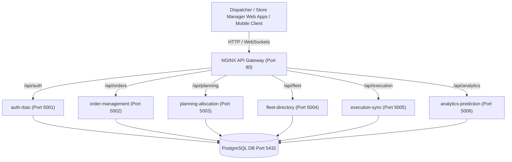

# Solution Architecture & System Overview

## Microservices System Topology

The Delivery Planning Monorepo follows an event-ready, domain-driven microservice architecture with an NGINX API Gateway acting as the single reverse-proxy entrypoint.

## Microservice Roles

1. **`auth-rbac`**: Handles user authentication, JWT issuance, and Role-Based Access Control (`dispatcher`, `loader`, `driver`, `store_manager`).
2. **`order-management`**: Manages order ingestion, delivery window state, and status tracking.
3. **`planning-allocation`**: Solves Capacitated Vehicle Routing Problem (CVRP) and maps orders to optimal delivery routes.
4. **`fleet-directory`**: Maintains vehicle capacities, driver status, asset registry, and maintenance schedules.
5. **`execution-sync`**: Ingests real-time GPS telemetry from drivers and updates stop completion status.
6. **`analytics-prediction`**: Computes ETA predictions, bottleneck analysis, and on-time performance metrics.

## Local Dev Performance Optimization
All microservices run on Alpine Node.js 20 runtime environments using containerized lightweight process managers to stay well within local resource and memory limits.
