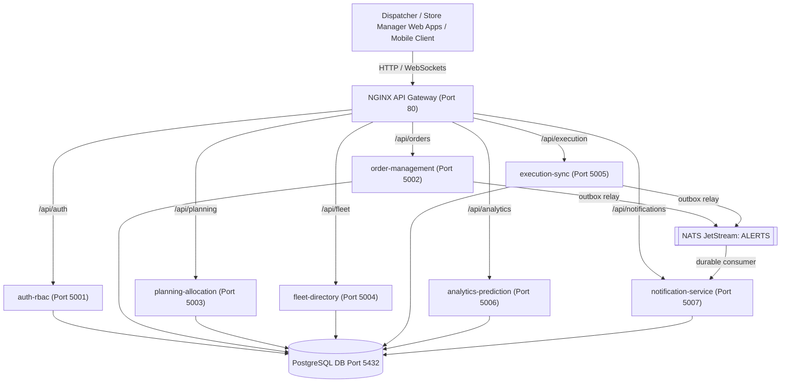

# Solution Architecture & System Overview

## Microservices System Topology

The Delivery Planning Monorepo follows an event-ready, domain-driven microservice architecture with an NGINX API Gateway acting as the single reverse-proxy entrypoint.

## Microservice Roles

1. **`auth-rbac`**: Handles user authentication, JWT issuance, and Role-Based Access Control (`dispatcher`, `loader`, `driver`, `store_manager`).
2. **`order-management`**: Manages order ingestion, delivery window state, and status tracking.
3. **`planning-allocation`**: Solves Capacitated Vehicle Routing Problem (CVRP) and maps orders to optimal delivery routes.
4. **`fleet-directory`**: Maintains vehicle capacities, driver status, asset registry, and maintenance schedules.
5. **`execution-sync`**: Ingests real-time GPS telemetry from drivers and updates stop completion status.
6. **`analytics-prediction`**: Computes ETA predictions, bottleneck analysis, and on-time performance metrics.
7. **`notification-service`**: Stores dashboard alerts from the NATS `ALERTS` stream and serves them to the dispatcher and store manager apps (REST + Server-Sent Events).

## Dashboard Alerts

Producers write an alert to their own outbox table (`order_alert_outbox`, `execution_alert_outbox`) in the same transaction as the change it describes; a relay publishes pending rows to NATS JetStream (subject `alerts.<type>`, stream `ALERTS`) and marks them published once the broker acknowledges. The alert id doubles as the JetStream message id and the primary key in notification-service, so retries and redeliveries are stored once.

| Type | Producer | Raised when | Seen by |
| --- | --- | --- | --- |
| `driver.incident` | execution-sync `POST /driver/incidents` | Driver reports an issue (sent immediately, or later from the phone's queue) | Dispatcher; store manager of that outlet |
| `driver.offline_delivery` | execution-sync `POST /sync` | A delivery recorded offline (photo proof, no handover code) syncs | Dispatcher |
| `store.discrepancy` | order-management `POST /:order_ref/receipt` | A receipt has missing or rejected units | Dispatcher |
| `store.delivery_problem` | execution-sync `POST /deliveries/:id/problems` | Store reports a problem with a delivery still on the way | Dispatcher |

Each alert carries `occurredAt` (when it happened, e.g. the phone's capture time) and `receivedAt` (when the server got it). Feeds sort by `occurredAt`; alerts that arrive more than 5 minutes late (queued during a network outage) are flagged `syncedLate`. Browsers open `GET /api/notifications/stream` with their bearer token and reconnect with `Last-Event-ID` to replay what they missed.

## Local Dev Performance Optimization
All microservices run on Alpine Node.js 20 runtime environments using containerized lightweight process managers to stay well within local resource and memory limits.
