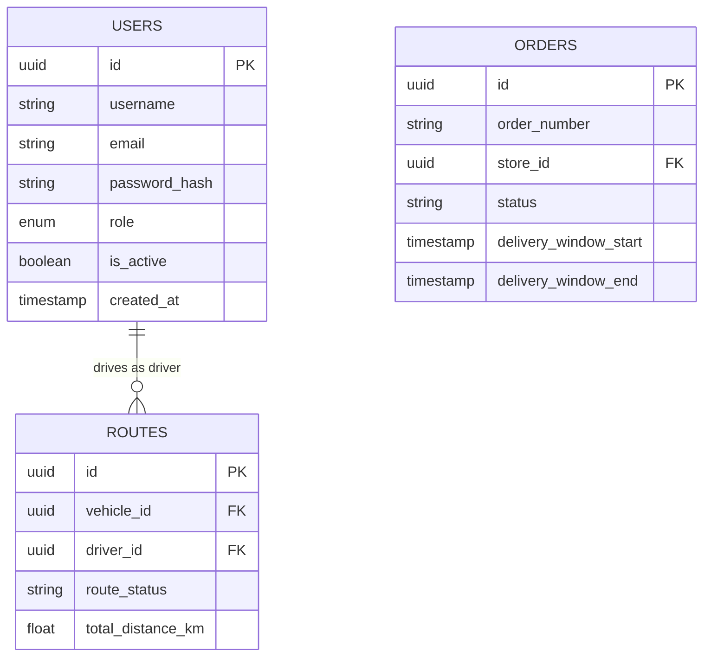
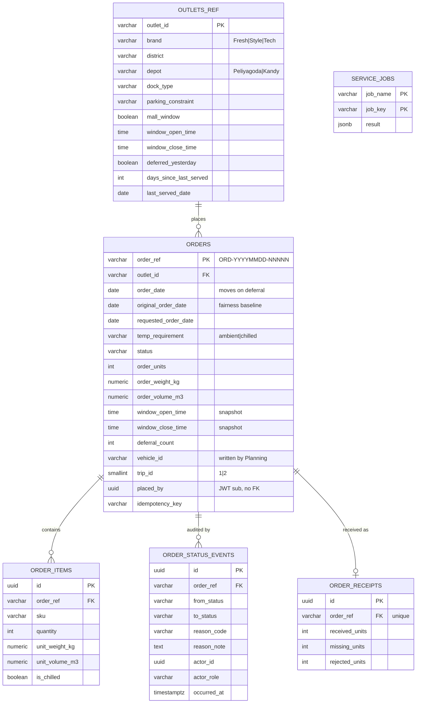

# Data Model & Schema Specification

## PostgreSQL Core Database Schema

The database utilizes domain-partitioned schemas managed via a central PostgreSQL instance seeded automatically on initialization.

### Entity Relationship Model

## Initial Seed Users (`01-seed.sql`)

| Username | Email | Role | Passphrase |
| :--- | :--- | :--- | :--- |
| `dispatcher_admin` | `dispatcher@delivery.com` | `dispatcher` | `Password123!` |
| `loader_jack` | `loader@delivery.com` | `loader` | `Password123!` |
| `driver_bob` | `driver@delivery.com` | `driver` | `Password123!` |
| `store_manager_alice` | `store_manager@delivery.com` | `store_manager` | `Password123!` |

---

## Order Management tables (owner: order-management, port 5002)

DDL lives in `infrastructure/postgres-init/02-order-management.sql`. It is additive and idempotent,
and the service never runs DDL at runtime. Demo **data** is seeded by the service at boot, because
it is dated relative to today and generated deterministically. **Structure** stays in SQL.

### Design decisions

- **Sole ownership.** Order Management is the only creator of these six tables and of
  `orders_ref_seq`. Every service shares the `public` schema, and `CREATE TABLE IF NOT EXISTS`
  silently skips a same-named table with different columns. That is how `users` broke. So the
  service asserts every table and column at boot, and refuses to start rather than self-heal.
  The outlet mirror is named `outlets_ref` so Fleet & Directory can own `outlets`.
- **`VARCHAR` + `CHECK`, not Postgres `ENUM`.** Enum type names are database-global, so they would
  collide across services exactly like table names do. They are also awkward to change: adding a
  value is non-transactional in older versions, and removing one needs a type rebuild. A `CHECK`
  constraint is local to its table and can be replaced in one migration.
- **No foreign keys to other teams' tables.** `placed_by` and `actor_id` hold the JWT `sub` as a bare
  `UUID`, so another team's migration order or deletes can never block ours.
- **Uniqueness on (outlet, order_date, temperature)**, partial, and excluding `cancelled`, `not_run`
  and carried-over (`deferral_count > 0`) orders. A Fresh outlet can therefore hold one ambient and
  one chilled order per day, a cancelled order can be re-placed, and a deferred order never collides
  with the outlet's own order for the day it moved to.
- **Totals derive from items.** `order_units`, `order_weight_kg` and `order_volume_m3` are
  recomputed in SQL, in the same transaction as every item write. This keeps the aggregate-row shape
  of the challenge datasets.
- **Window snapshot.** Each order copies the outlet's delivery window at creation, so a later change
  to the outlet never rewrites an open order's lateness reference.
- **Append-only audit.** Every status change writes exactly one `order_status_events` row in the same
  transaction. Deferrals always carry a controlled `reason_code`. This is the answer to "deferrals
  lack a clear record".
- **Time types.** `TIMESTAMPTZ` for instants, `DATE` for business days, `TIME` for wall-clock
  windows. All business-day logic is evaluated in Asia/Colombo.
