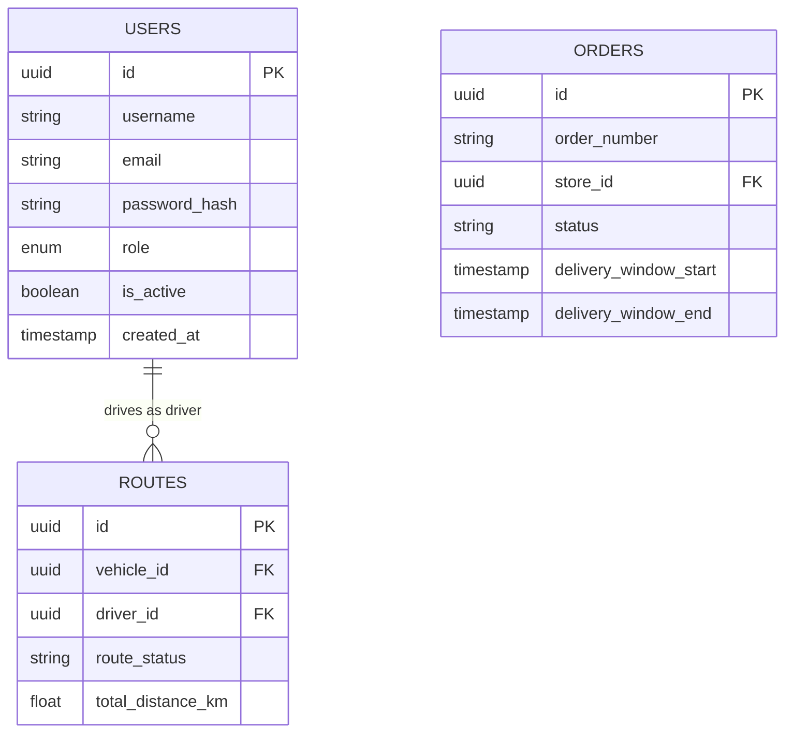

# Data Model & Schema Specification

## PostgreSQL Core Database Schema

The database utilizes domain-partitioned schemas managed via a central PostgreSQL instance seeded automatically on initialization.

### Entity Relationship Model

## Initial Seed Users (`01-seed.sql`)

| Username | Email | Role | Passphrase |
| :--- | :--- | :--- | :--- |
| `dispatcher_admin` | `dispatcher@delivery.com` | `dispatcher` | `Password123!` |
| `loader_jack` | `loader@delivery.com` | `loader` | `Password123!` |
| `driver_bob` | `driver@delivery.com` | `driver` | `Password123!` |
| `store_manager_alice` | `store_manager@delivery.com` | `store_manager` | `Password123!` |
